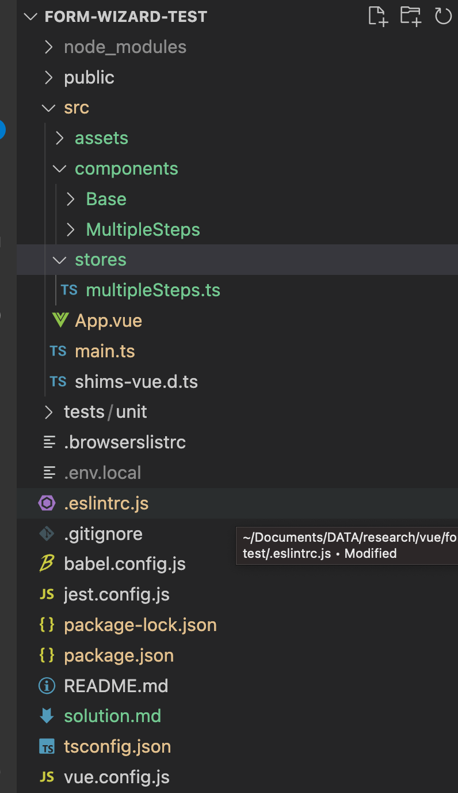

# Form wizard Test project
> This project is a test project
# Table of Contents
  * [Project Setup](#build-setup)
  * [Project tech stacks](#tech-stacks)
  * [Project architecture and approach ](#architecture-and-approach)
  * [Todo](#todo)

## Build setup
``` bash
#install vue-cli
npm install -g @vue/cli
# OR
yarn global add @vue/cli

#install all dependencies
npm install

# serve with hot reload at localhost:8080
npm run serve

```
## Tech stacks
- Main framework: Vue 3, Typescript
- State management: Pinia 
- Styling: SASS/SCSS

## Architecture and approach
#### General guideline

### Components structure

I divided components into 2 types:
- Base components: will be implemented in src/components/Base
- General components: will be implemented in src/components/

### A component structure (Example:  FormContent)
- FormContent.vue : template file
- index.ts : Typescript file with all script definition
- index.scss : component styling
- index.spec.ts : component unit test

## Todo
- Clarify the requirement for the form fields so that I can implement form's validation.
- Add a steps progress bar so that user can know what step they are working on.
- Fix perfect pixel
- Write unit tests


